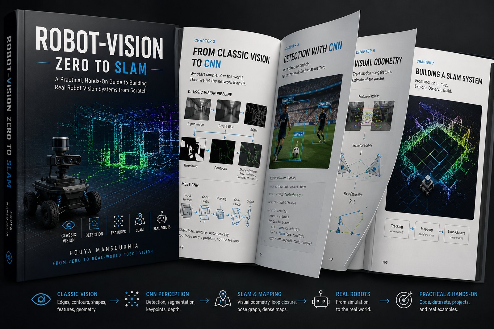
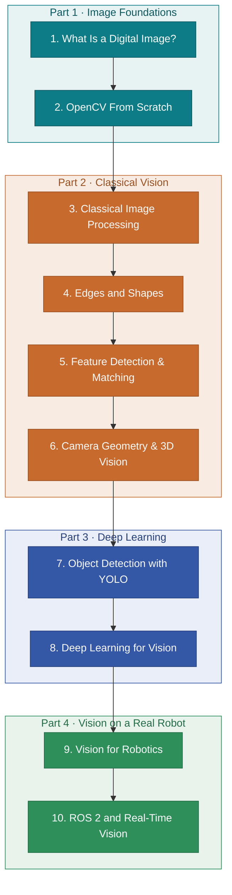
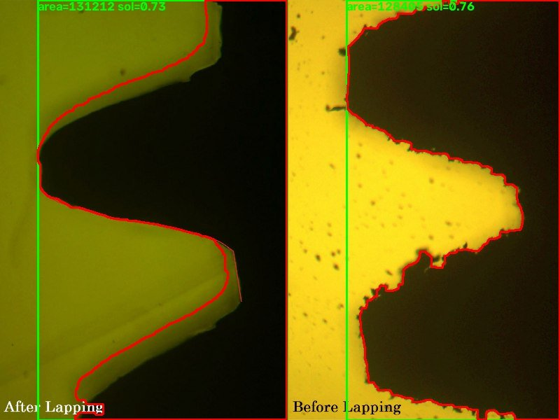
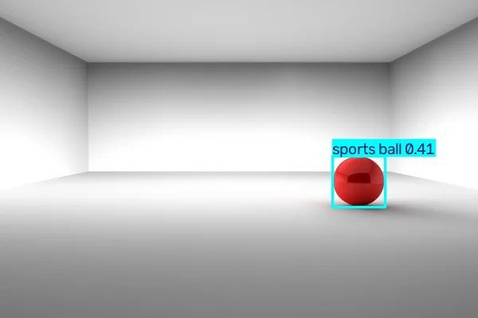

# Robot Vision: Zero to SLAM

<p align="center">
  
</p>

This is a free book about computer vision for robotics, written in English and Persian. It starts from a question most tutorials skip, "what is a digital image, really?", and does not stop until you have followed the whole path to Visual SLAM and ROS 2.


The whole book is plain HTML. There is nothing to install and nothing to build. You open a file in a browser and read it, or you read it online once GitHub Pages is turned on.

## Why this book exists

Most people meet computer vision through a detection script they copy, run once, and never really understand. It works, the boxes appear on the screen, and the gap between "it runs" and "I know why it runs" stays open.

This book tries to close that gap by going in order. An image is a grid of numbers before it is anything else, so that is where Chapter 1 starts. Everything after it builds on what came before: filters need pixels, edges need filters, features need edges, camera geometry needs features, and SLAM needs all of it at once. By the last chapter you are running a detector inside a ROS 2 node and thinking about latency and frame rate, and none of it feels like a leap because you walked every step.

## Who it is for

You should be able to read basic Python. That is the only real requirement. No prior computer vision, no linear algebra course, no math background is assumed. New terms are defined where they first show up and collected again in a glossary at the end of each chapter, so you can always look back instead of getting stuck.

## What you will learn

- How an image is stored as a matrix of numbers, and how to build and change one with NumPy
- The classical toolbox: convolution, blur, thresholding, histograms, morphology, gradients, Canny, contours
- Feature detection and matching with Harris and ORB, and why it is the basis of panoramas, visual odometry, and SLAM
- Camera geometry: the pinhole model, the camera matrix, calibration, and stereo depth
- Object detection with YOLO, including IoU, NMS, dataset and label formats, COCO, and the YOLO family up to recent versions
- How a CNN learns its own filters, semantic segmentation, and transfer learning
- Visual odometry, optical flow, Visual SLAM, and sensor fusion with a Kalman filter
- Running vision in ROS 2: nodes and topics, `cv_bridge`, QoS, RGB-D synchronization, and the latency and frame-rate trade-offs behind a real-time system

## The path through the book



<p align="center">
  
  
</p>

<p align="center"><sub>Left: contour extraction and shape measurement from the classical-vision chapters. Right: a YOLO detection from Chapter 7.</sub></p>

The order is linear, and `index.html` is the table of contents that links every chapter.

| # | Chapter | Part |
|---|---------|------|
| 1 | What Is a Digital Image? | Image Foundations |
| 2 | OpenCV From Scratch | Image Foundations |
| 3 | Classical Image Processing | Classical Vision |
| 4 | Edges and Shapes | Classical Vision |
| 5 | Feature Detection & Matching | Classical Vision |
| 6 | Camera Geometry & 3D Vision | Classical Vision |
| 7 | Object Detection with YOLO | Deep Learning |
| 8 | Deep Learning for Vision | Deep Learning |
| 9 | Vision for Robotics | Vision on a Real Robot |
| 10 | ROS 2 and Real-Time Vision | Vision on a Real Robot |

## How to read it

Start at `index.html`, or open `01-what-is-a-digital-image.html` directly, and go in order. Every chapter has "Try it yourself" boxes with code you can copy, run, and check against the output shown in the text, and it has a glossary that every technical term links back to through a footnote. Chapters 1 and 2 also end with a "Common mistakes" section.

The header has two toggles, one for English and Persian, one for light and dark. Your choice is saved in the browser, so you only set it once.

## Reading online

Because the book is just static pages, it runs as a GitHub Pages site with no configuration. Turn on Pages in the repository settings, with branch `main` and the root folder, and it will be served here:

```
https://pouya-mansournia.github.io/robot-vision-zero-to-slam/
```

Until that is on, clone or download the repository and open the files locally:

```bash
git clone https://github.com/Pouya-Mansournia/robot-vision-zero-to-slam.git
cd robot-vision-zero-to-slam
# open index.html in your browser
```

Each HTML file stands on its own. The only things it loads from the network are the fonts and the KaTeX stylesheet, so the math renders best when you are online.

## Running the code samples

The code targets Python 3 with the usual vision stack. The chapters bring in, roughly in this order, NumPy and OpenCV (`opencv-python`), then PyTorch for the deep learning chapters, then Ultralytics YOLO in Chapter 7, and finally ROS 2 with `cv_bridge` in Chapter 10.

There is no single requirements file on purpose. The dependencies grow as the book goes on, and Chapter 10 in particular expects a working ROS 2 installation that the book does not try to cover. Each chapter names the packages it needs at the point where it needs them.

## Repository structure

```
robot-vision-zero-to-slam/
├── index.html                        table of contents
├── 01-what-is-a-digital-image.html
├── 02-opencv-basics.html
├── 03-classical-image-processing.html
├── 04-edges-and-shapes.html
├── 05-feature-detection.html
├── 06-camera-geometry-3d-vision.html
├── 07-object-detection-yolo.html
├── 08-deep-learning-vision.html
├── 09-robot-vision-slam-fusion.html
└── 10-ros2-realtime-inference.html
```

## Status and limitations

All 10 chapters are written and readable in both languages. The code samples are meant to be run and read next to the text; they are not packaged as a test suite or a runnable project, and there is no lock file or CI. Chapter 10 assumes ROS 2 is already installed.

No license has been chosen yet. Until a `LICENSE` file is here, "free" means free to read, not a grant of reuse rights. A Creative Commons license for the prose is the likely direction.

## Contributing

Corrections and clearer explanations are welcome. Open an issue that names the chapter, the section, and what is wrong or unclear, or send a pull request with the fix. One rule matters more than the rest: a change to any passage has to update both the English and the Persian version in the same pull request. See [CONTRIBUTING.md](CONTRIBUTING.md) for the details.

## Author

Pouya Mansournia
